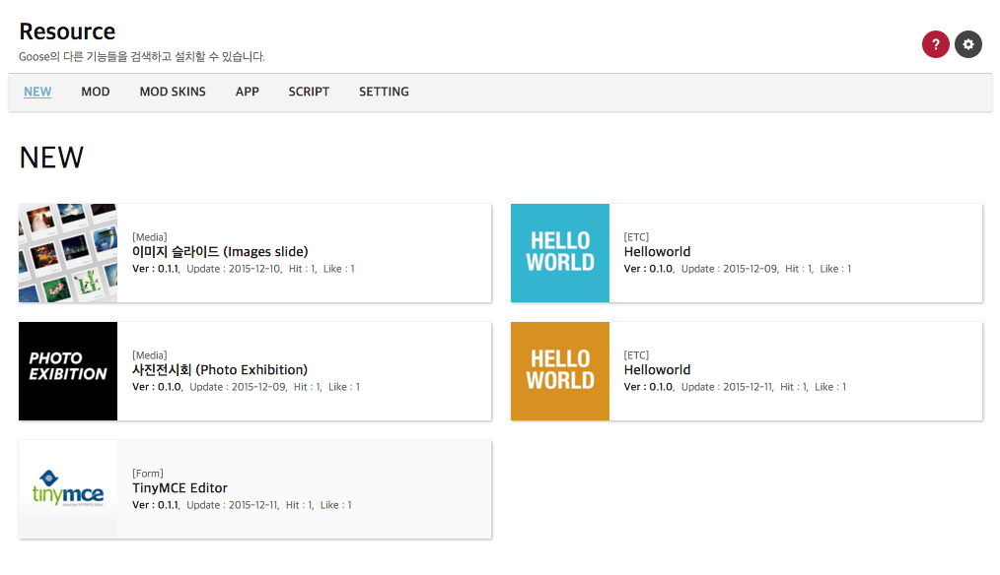

### About module

이 모듈은 관리자에서 Goose에 관련된 컨텐츠나 도구들을 찾고 쉽게 설치하기 위하여 만들어졌습니다.  
여기에서 표시되는 컨텐츠들은 http://src.goose-dev.com 에 있는 것들입니다.

 {.border-center}

-------------------

### FTP Setting

모듈 화면에서 `SETTING` 메뉴를 선택하면 ftp설정 폼이 나옵니다.  

 {.border-center}

1. 컨텐츠를 설치하기 전에 먼저 ftp를 설정해야 합니다. ftp정보를 등록하지 않으면 컨텐츠 본문에서 Install 버튼이 나오지 않게 됩니다.
1. 작성폼에서 Hostname, ID, Password 항목을 입력하고 Goose가 설치된 곳을 기준으로 Location 항목을 확인해줍니다.
1. 입력항목을 다 작성하면 `FTP 테스트` 버튼을 누릅니다.  
   FTP테스트는 접속이 되는지와 로그인이 되는지와 Goose가 설치된 위치를 확인합니다.
1. 테스트가 이상없으면 그옆에 `업데이트` 버튼이 활성화 되어 버튼을 누를 수 있습니다.
1. 업데이트 버튼을 누르면 ftp정보를 `{GOOSE}/data/ftp.php`에 저장합니다.

-------------------

### Contents index

Goose의 컨텐츠들은 주로 Goose의 모듈, 모듈스킨이 있고, script 모듈에서의 스크립트 파일, 방문객을 대상으로 하는 앱들을 검색할 수 있습니다.  
형태는 http://src.goose-dev.com 와 똑같으며 다른 점이라면 글 본문에서 인스톨 버튼이 생깁니다.

다음은 카테고리에 대한 설명입니다.

* __NEW__  
  모든 자료들을 최신순으로 정렬되어 출력됩니다.
* __MOD__  
  Goose에서 중요한 프로그램을 담당하는 <u>모듈</u>입니다.
* __MOD SKINS__  
  기존에 있는 <u>모듈의 스킨</u>입니다.  
  모듈에 따라 다르지만 스킨에 따라 모듈의 디자인이나 형태를 스킨에 따라 다르게 사용할 수 있습니다.
* __APP__  
  Goose를 이용하여 방문객에게 서비스하는 <u>앱이나 홈페이지</u>들입니다.  
  이것들은 Goose 외부에서 사용되는 컨텐츠이므로 인스톨을 할 수 없으며 글 본문에 있는 설명을 잘 보고 활용하면 되겠습니다.
* __SCRIPT__  
  프로그램 실행용으로 쓰는 script 모듈에서 <u>실행 스크립트</u>들입니다.

-------------------

### Install content

FTP를 선택했으면 관리자속의 컨텐츠를 쉽게 설치할 수 있습니다.

1. **FTP Setting** 섹션에서 ftp설정을 합니다.
1. 설치할 컨텐츠 글을 골라서 상세보기 로 갑니다.
1. 선택한 글 상세보기 페이지 아래쪽에 내려가보면 다음 그림과 같이 **Install** 버튼이 있는것을 볼 수 있습니다.  
    {.border}
1. **Install** 버튼을 누르면 다음 그림과 같이 설치 팝업창이 열립니다.  
   
1. 설치경로를 확인하고 **INSTALL** 버튼을 누르면 설치경로에 적힌 위치에 설치합니다.  
   정상적으로 설치되었으면 설치가 완료되었다는 메세지가 뜨면서 설치 창이 닫힙니다. 그러나 설치가 되지 않았으면 해당 오류메세지가 나옵니다.

> 설치경로를 변경하여 설치할 수 있지만 그대로 설치하는것을 권장합니다.

-------------------

### APP

다른 카테고리와 다르게 APP은 Goose와는 다른 장소에서 설치됩니다. 그래서 쉬운 인스톨은 할 수 없으며 글 본문에 있는 다운로드 링크를 이용하여 받아야 합니다.  
APP은 같은 서버지만 Goose와 다른 경로에 사용되기도 하고, 다른 서버에서 사용되기도 하고, 다른 플랫폼으로도 사용되기도 할것입니다.  
그래서 APP 카테고리의 컨텐츠는 다른 카테고리와 전혀 다른 타입의 컨텐츠입니다.
