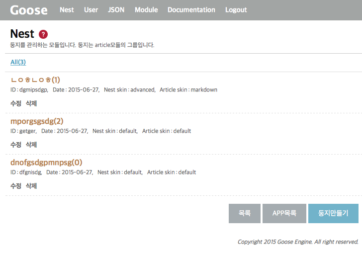

### 소개

Nest(둥지)라는 모듈은 Article모듈에 있는 글들의 그룹이라고 볼 수 있습니다. 다시말해 article의 글들을 담아놓은 바구니라고 볼 수 있습니다.  
단순히 article의 그룹화 시키는것뿐만 아니라 둥지의 성격이나 특징을 특화하여 개성있는 둥지를 만들어 관리할 수 있습니다. Goose 프로그램의 핵심적인 모듈이라고 할 수 있습니다.

`{goose}/nest/index/` 주소로 접속하면 아래 그림과 같이 nest 목록이 나옵니다.

 {.border}  
처음 접속하는거라면 아무것도 없을겁니다.

#### 둥지 만들기 항목
* __Nest Skin__  
nest 모듈의 스킨입니다. 용도에 맞게 다른 스킨으로 바꿔서 사용할 수 있습니다. 적용되는 스킨에 따라 항목이 변하기도 합니다.  
__둥지를 만들고나서 수정할때 변경하지 않는것을 권합니다.__
* __Article Skin__  
article 모듈의 스킨입니다. 여기에서 스킨을 설정합니다.
* __아이디__  
고유 문자값입니다. 다른 둥지와 서로 같은이름을 사용할 수 없습니다.
* __둥지이름__  
둥지에 대한 이름입니다. 기호나 공백에 대한 제약이 없습니다.
* __목록수__  
article 모듈에서 한페이지에서 출력되는 글 갯수입니다.
* __분류사용__  
category 모듈을 연계하여 article 모듈의 글들을 분류할 수 있습니다.


### setting.json

모듈의 환경설정 파일입니다. 설정에 대한 소개는 다음과 같습니다.

* __name__  
모듈의 id값

* __title__  
출력되는 제목값

* __description__  
모듈의 설명

* __permission__  
접근권한 번호 (숫자가 높을수록 권한이 높습니다.)

* __adminPermission__  
모듈 관리자 권한 번호 (숫자가 높을수록 권한이 높습니다.)

* __install__  
인스톨이 필요한 모듈인지에 대한 유무를 정합니다.

* __skin__  
다른형태로 목록이나 폼 페이지가 출력되는 스킨값

* __countArticle__  
한페이지에 출력되는 __article__ 갯수

* __articleListTypes__  
article 목록타입

* __thumnailSize__  
썸네일 이미지 사이즈 설정


### 데이터베이스 필드

다음은 nest 모듈을 설치할때 사용되는 db 필드들입니다.

| Field      | Type       | Comment
| : -------: | :--------: | :----------------------------
| srl        | int        | 고유번호
| app_srl    | int        | app 모듈의 고유번호
| id         | varchar    | 고유 id값
| name       | varchar    | 이름
| json       | text       | 유동적인 json타입의 설정값
| regdate    | varchar    | 날짜


### 모듈 API 안내

모듈에서 제공하는 api입니다. 우선 다음과 같이 모듈 인스턴스 변수값에 담아야합니다.
```
$nest = Module::load('nest');
```

* __$nest->getCount()__  
조건에 맞는 글 갯수를 가져옵니다.  
```
$count = $nest->getCount(array(
	'where' => 'app_srl='.(int)$v['srl'])
));
```

* __$nest->getItems()__  
조건에 맞는 글들을 모음을 가져옵니다.
```
$data = $nest->getItems(array(
	'where' => 'app_srl=1'
));
```

* __$nest->getItem()__  
조건에 맞는 글 한개만 가져옵니다.
```
$data = $nest->getItem(array(
	'where' => 'srl=1'
));
```

* __$nest->transaction()__  
글을 등록하거나 수정, 삭제 처리합니다.
```
$result_make = $nest->transaction('create', $_POST); // make
$result_modify = $nest->transaction('modify', $_POST); // modify
$result_remove = $nest->transaction('remove', $_POST); // remove
```  
$\_POST값에 대해서는 `{module}/skin/default/view_form.php` 파일을 참고해주세요.